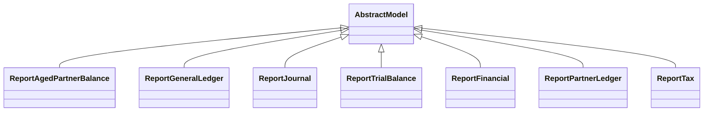

# Reports

Report definitions and templates in accounting_pdf_reports.

## Available Reports

### PDF/Document Reports
- **General Ledger** (PDF/Print)
- **Partner Ledger** (PDF/Print)
- **Trial Balance** (PDF/Print)
- **Financial Report** (PDF/Print)
- **Tax Report** (PDF/Print)
- **Aged Partner Balance** (PDF/Print)
- **Journals Audit** (PDF/Print)
- **Journals Entries** (PDF/Print)

## Report Files

- **__init__.py** (Python logic)
- **report_aged_partner.py** (Python logic)
- **report_aged_partner.xml** (XML template/definition)
- **report_financial.py** (Python logic)
- **report_financial.xml** (XML template/definition)
- **report_general_ledger.py** (Python logic)
- **report_general_ledger.xml** (XML template/definition)
- **report_journal_audit.xml** (XML template/definition)
- **report_journal_entries.xml** (XML template/definition)
- **report_journal.py** (Python logic)
- **report_partner_ledger.py** (Python logic)
- **report_partner_ledger.xml** (XML template/definition)
- **report_tax.py** (Python logic)
- **report_tax.xml** (XML template/definition)
- **report_trial_balance.py** (Python logic)
- **report_trial_balance.xml** (XML template/definition)
- **report.xml** (XML template/definition)

## Notes
- Named reports above are accessible through Odoo's reporting menu
- Python files define report logic and data processing
- XML files contain report templates, definitions, and formatting
- Reports are integrated with Odoo's printing and email systems
