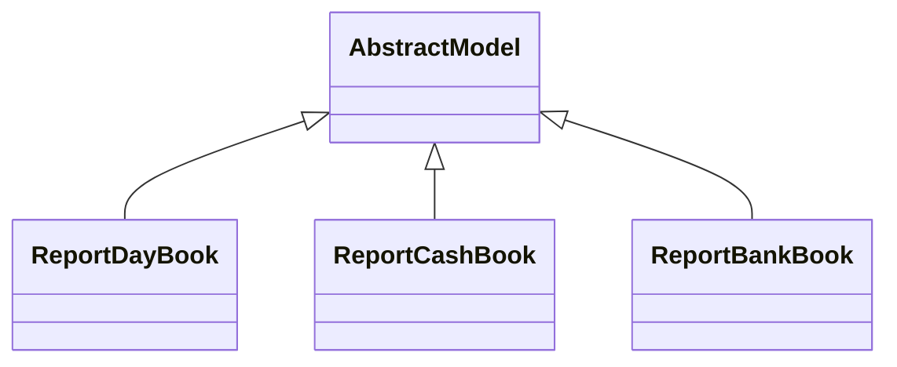

# Reports

Report definitions and templates in om_account_daily_reports.

## Available Reports

### PDF/Document Reports
- **Day Book** (PDF/Print)
- **Cash Book** (PDF/Print)
- **Bank Book** (PDF/Print)

## Report Files

- **__init__.py** (Python logic)
- **report_bankbook.py** (Python logic)
- **report_bankbook.xml** (XML template/definition)
- **report_cashbook.py** (Python logic)
- **report_cashbook.xml** (XML template/definition)
- **report_daybook.py** (Python logic)
- **report_daybook.xml** (XML template/definition)
- **reports.xml** (XML template/definition)

## Notes
- Named reports above are accessible through Odoo's reporting menu
- Python files define report logic and data processing
- XML files contain report templates, definitions, and formatting
- Reports are integrated with Odoo's printing and email systems
