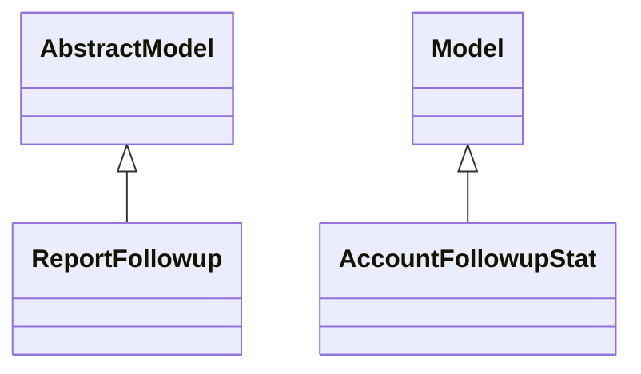

# Reports

Report definitions and templates in om_account_followup.

## Available Reports

### Analytical/Dashboard Reports
- **Follow-ups Analysis** (Analysis/Dashboard)

## Report Files

- **followup_print.py** (Python logic)
- **followup_report.py** (Python logic)
- **followup_report.xml** (XML template/definition)
- **__init__.py** (Python logic)

## Notes
- Named reports above are accessible through Odoo's reporting menu
- Python files define report logic and data processing
- XML files contain report templates, definitions, and formatting
- Reports are integrated with Odoo's printing and email systems
