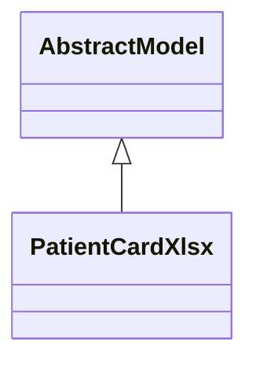

# Reports

Report definitions and templates in om_hospital.

## Available Reports

### PDF/Document Reports
- **Patient Details** (PDF/Print)
- **Patient Card** (PDF/Print)
- **Patient Card Excel** (PDF/Print)

## Report Files

- **__init__.py** (Python logic)
- **patient_card_xls.py** (Python logic)
- **patient_card.xml** (XML template/definition)
- **patient_details_template.xml** (XML template/definition)
- **report.xml** (XML template/definition)

## Notes
- Named reports above are accessible through Odoo's reporting menu
- Python files define report logic and data processing
- XML files contain report templates, definitions, and formatting
- Reports are integrated with Odoo's printing and email systems
